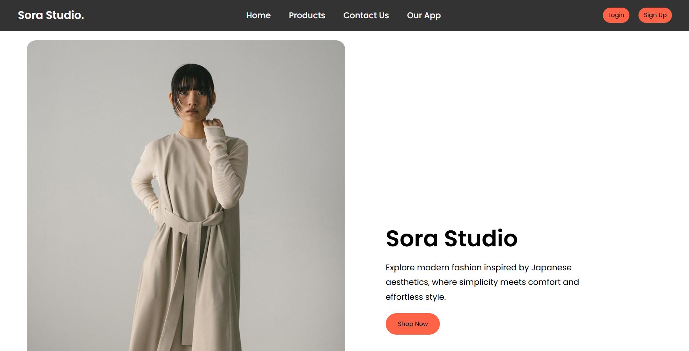

# Sora Studio

A clean and responsive fashion landing page inspired by modern Japanese aesthetics.

Sora Studio is a frontend practice project built to strengthen my understanding of **HTML, CSS, responsive design, navigation, layouts, and basic UI interactions**.

## 📸 Screenshot

> Place your project screenshot inside a folder named `screenshots` with the filename `sora-studio.png`.

## ✨ Features

- Responsive navigation bar
- Desktop and mobile navigation
- Animated hamburger menu
- Smooth scrolling between sections
- Hero section with fashion imagery
- Product/merchandise cards
- Customer reviews section
- App download section
- Responsive footer
- Mobile-friendly layout
- Hover effects and basic CSS animations

## 🛠️ Built With

- **HTML5**
- **CSS3**
- **Google Fonts**
- Flexbox
- CSS Grid
- Media Queries

## 🎨 Design

The website uses a minimal fashion-focused design with a neutral color palette and Japanese-inspired visual direction.

The main sections include:

1. **Home** — Hero section introducing Sora Studio
2. **Products** — Featured merchandise
3. **Reviews** — Customer feedback
4. **About** — App/download section
5. **Contact** — Contact information in the footer

## 📱 Responsive Design

The layout adapts to different screen sizes using CSS media queries.

### Desktop

- Full navigation links
- Three-column product grid
- Side-by-side hero layout
- Side-by-side app section

### Mobile

- Hamburger navigation
- Single-column product layout
- Stacked hero section
- Centered content
- Responsive footer
- Mobile-friendly app section

## 🎯 What I Learned

While building Sora Studio, I practiced:

- Structuring a webpage using semantic HTML
- Creating layouts using Flexbox
- Creating product grids using CSS Grid
- Making websites responsive with media queries
- Creating mobile navigation
- Using IDs for section navigation
- Adding smooth scrolling
- Working with local images
- Using Google Fonts
- Adding hover effects and CSS transitions
- Organizing frontend project files

## 👨‍💻 Author

**Krishna**

B.Tech CSE Student | Frontend Development Learner

---

⭐ If you like the project, consider giving the repository a star!
